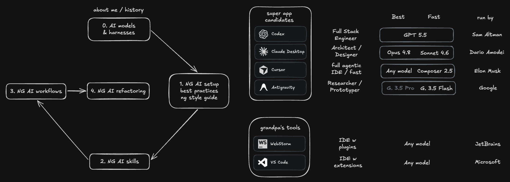

# NG Agentic Skills

A library of **agent skills** for Angular work – focused, reusable capabilities an AI agent can invoke
for signal forms, data access, SignalStore state, migrations, refactoring, accessibility, performance
and security reviews, prototyping, unit and e2e tests, and verifying a feature in the browser – plus
skills for the agentic process itself: skill authoring, brainstorming and grilling, plan execution,
test-driven development, bug diagnosis, code review, prose de-slopping, handover and git stack rewrites.

Companion repo for the talk **AGENTS.md Is Not Enough: Build Skills, Don't Download Them** and the
[Agentic Engineering blog post series](https://www.angulararchitects.io/blog/best-llms-for-angular/).

[Slides](https://speakerdeck.com/lx_t/agents-dot-md-is-not-enough-build-skills-dont-download-them) ·
[Blog post](https://www.angulararchitects.io/blog/ae-skills-for-angular/) ·
[Full skill directory](02-SKILLS.md) ·
[Skill maintenance](SKILL-MAINTENANCE.md)

## The skills

Skills live under `.agents/skills/`. Each skill is a folder with a `SKILL.md` plus optional
`references/`, `scripts/`, or `assets/` support files loaded just in time. They are split into
**custom** skills authored here (MIT-licensed) and **third-party** skills adapted from public sources
with their origins and local adaptations recorded in `skill-sources.json`.

See [`02-SKILLS.md`](02-SKILLS.md) for the full directory – every skill with a one-line description,
grouped into custom and third-party – and [`SKILL-MAINTENANCE.md`](SKILL-MAINTENANCE.md) for how
skills are added, updated and retired.

This sketch outlines the Agentic Engineering workshop arc: choosing AI models and harnesses, setting up an Angular AI workspace with best practices and style guides, building reusable AI skills, applying AI supported workflows, and using those foundations for targeted Angular refactoring. The skills in this repo are the "building reusable AI skills" step.

## Workspace setup

This repository is the [ng-agentic](https://github.com/L-X-T/ng-agentic) workspace with the skills
library added. The step-by-step setup – Angular CLI, Husky, ESLint and lint-staged, the opinionated
`AGENTS.md`, MCP servers and per-agent files, feedback loops and recommended companion apps – is
documented in the [ng-agentic README](https://github.com/L-X-T/ng-agentic#readme) and not repeated here.
Two parts are worth a note because the files live in this repo too:

## Angular Coding Style Guide

Find our [Angular Coding Style Guide](style-guide/style-guide.md) in the `style-guide` folder.

It contains general guidelines for writing clean and maintainable code in Angular projects, as well as specific style guides for different file types such as Git commits, HTML templates, NPM packages, SCSS styling files, and TypeScript files.

Anyone who copies and pastes this style guide should replace the `lxt-` class-name prefix with a prefix that is meaningful for her or his own app.

## Opinionated Agent Instructions

This commit turns `AGENTS.md` from a generic Angular guidance file into a repo specific operating contract for AI agents, adding workflow rules for preserving user edits, loading only the narrowest relevant style guides, applying modern Angular v22+ defaults, keeping TypeScript strict, and respecting template, accessibility, service, and testing boundaries.

Two things to keep in mind when adopting these instructions:

- **They are tuned for a specific model generation.** This `AGENTS.md` was developed and tested against Opus 4.5 to Opus 4.8 and GPT-5.2 to GPT-5.5. Now that the next, more intelligent generation has arrived – Fable 5.1, Opus 5.5, GPT-6 Astra, GPT-6.1 Sol – that reevaluation is due: check whether the detailed instructions on Angular and TypeScript best practices are still necessary to get high-quality code output, or whether the newer models already internalize them. Treat this as a constantly evolving instruction set, not a finished artifact.
- **Less can be more.** Parts of the community argue that shorter instruction files outperform long ones, because every rule competes for the model's attention. So don't copy this file verbatim – play around with the instructions, measure what actually changes your output quality, and fine-tune them for your own projects and workflows.
